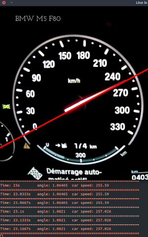
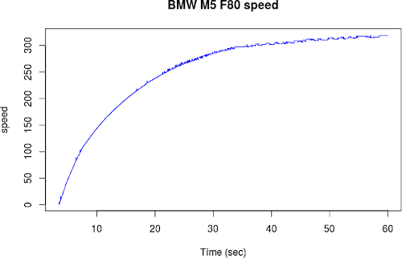

# Computer vision assignment: Car speed tracking #
Suppose to be part of the engineering team of a car racing team. To increase your chances of winning the next race, you want to analyze the performance of your opponent’s cars. In
particular, you are interested to plot the speed/time curve during the acceleration from 0 to the maximum car speed.
After some YouTube browsing, you discovered that one of your opponents have a camera mounted on the cockpit showing the car speed dial during one of their tests.

The goal is to implement a C++ program using the OpenCV library that loads the video,
processes all the frames and recovers the speed at each frame from the left dial.
In particular, the program workflow is the following:

 1. Load the video named “carspeed.mp4”
 2. For each frame:
    a. Isolate the pixels belonging to the left dial
    b. Use the hough transform to recover the line parameters of the dial
    c. Output the current frame, the time elapsed (video is at 30 frames per second), the line angle, and the car speed (the function relating the line angle with the car speed should be manually/empirically defined)

After that, produce a plot (with Matlab or Excel) showing the camera speed over time.

On this assignment are also included extra files:
	- output.mp4, output video for debugging
	- speed.R, simple R script to plot car speed
	- speedPlot.png, output result from speed.R
	- speed.csv, dataset speed|frame. It is created by the open-cv application


### Build and Run

The following code was tested considering:
	- Ubuntu 16.04.4 LTS
	- Ubuntu 17.10
	- Cpp 11+ 


How to build:

``` bash
$ mkdir build
$ cd build
$ cmake ../ -DOpenCV_DIR="<insert the path of your opencv/build directory>"
$ make
```

How to run:
``` bash
$ cd build
$ make run
```


or, alternatively:

``` bash
$ make install
$ cd dist/bin
```

and run the generated executable

### Test
In order to test the project you can download two videos from [here](https://drive.google.com/open?id=1tbn7S4BkcmeBueweHGmw8lz5x58hAXLD) and put them in the main folder. 

 

### Contacts
If you have any doubts about the project do not hesitate to write me an e-mail:  854866[at]stud[dot]unive[dot]it | acina04[at]gmail[dot]com

